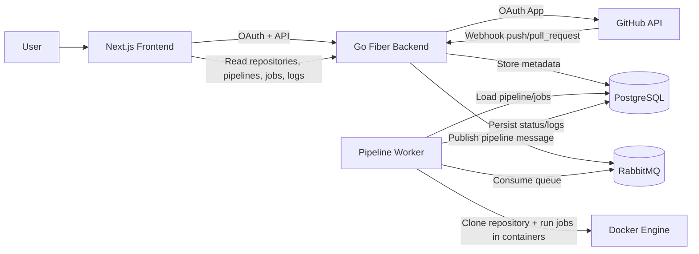

# Pipe

Pipe is a full-stack CI/CD orchestration platform that connects GitHub repositories, listens to repository events, and runs containerized pipeline jobs with execution logs.

## Overview

Pipe includes:

- **Backend API** (Go + Fiber): authentication, repository onboarding, webhook handling, pipeline/job APIs
- **Worker Runtime** (Go): asynchronous pipeline execution from a RabbitMQ queue
- **Frontend Dashboard** (Next.js): GitHub login, repository import, job configuration, and log viewer
- **Data Services**: PostgreSQL (state), RabbitMQ (queue), Redis (available in compose stack)

## Architecture



## Key Features

- GitHub OAuth login and JWT-based session handling
- Import repositories from GitHub into Pipe
- Automatic webhook creation during repository import
- Pipeline trigger on `push` and `pull_request` events
- Custom per-repository job templates (image, workdir, commands, order)
- Containerized job execution with persisted logs and status history
- Dashboard for repository management, pipeline history, and logs

## Repository Structure

```text
/home/runner/work/Pipe/Pipe
├── backend/                # Go API, queue integration, worker, DB migrations
│   ├── cmd/api/            # Backend entrypoint
│   ├── internal/           # Services, handlers, middleware, executor, worker
│   ├── db/migrations/      # PostgreSQL schema migrations
│   └── db/sqlc/            # Generated SQL access layer
├── frontend/               # Next.js dashboard application
└── docker-compose.yaml     # Local PostgreSQL, Redis, RabbitMQ services
```

## Tech Stack

- **Backend:** Go, Fiber, pgx, sqlc, RabbitMQ client, Docker client
- **Frontend:** Next.js (App Router), React, TypeScript, Tailwind CSS, Axios
- **Infrastructure:** PostgreSQL, RabbitMQ, Redis, Docker

## Prerequisites

- Docker + Docker Compose
- Go 1.26+
- Node.js 20+
- npm
- (Optional) `migrate` CLI for manual migration management

## Local Development Setup

### 1) Start infrastructure services

From repository root:

```bash
docker compose up -d
```

This starts:

- PostgreSQL on `localhost:5432`
- RabbitMQ on `localhost:5672` (management UI: `http://localhost:15672`)
- Redis on `localhost:6379`

### 2) Configure backend environment

Create `/home/runner/work/Pipe/Pipe/backend/.env`:

```env
POSTGRES_DB=******localhost:5432/cicd?sslmode=disable
GITHUB_CLIENT_ID=your_github_oauth_client_id
GITHUB_CLIENT_SECRET=your_github_oauth_client_secret
GITHUB_CALLBACK_URL=http://localhost:3000/auth/callback
JWT_SECRET=replace_with_a_strong_secret
WEBHOOK_BASE_URL=https://your-public-backend-url
RABBITMQ_URL=******localhost:5672/
```

> `WEBHOOK_BASE_URL` must be reachable by GitHub for webhook delivery.

### 3) Run backend

```bash
cd /home/runner/work/Pipe/Pipe/backend
go run cmd/api/main.go
```

Backend listens on `http://localhost:8080`.

### 4) Configure frontend environment

Create `/home/runner/work/Pipe/Pipe/frontend/.env.local`:

```env
NEXT_PUBLIC_API_URL=http://localhost:8080
```

### 5) Run frontend

```bash
cd /home/runner/work/Pipe/Pipe/frontend
npm install
npm run dev
```

Frontend runs on `http://localhost:3000`.

## Database Migrations

Migration files are located in:

- `/home/runner/work/Pipe/Pipe/backend/db/migrations`

Helper commands (from `/home/runner/work/Pipe/Pipe/backend`):

```bash
make migrate-up
make migrate-down
make migrate-version
```

## API Surface (High Level)

### Authentication

- `GET /auth/github`
- `GET /auth/github/callback`
- `GET /auth/me`
- `GET /auth/logout`

### GitHub Integration

- `GET /github/repositories`
- `GET /github/repositories/:owner/:repo`

### Repository Management

- `POST /repositories/import`
- `GET /repositories`
- `GET /repositories/:id`
- `DELETE /repositories/:id`

### Pipelines and Jobs

- `GET /pipelines/:id`
- `GET /pipelines/:id/jobs`
- `GET /repositories/:id/pipelines`
- `GET /repositories/:id/jobs`
- `POST /repositories/:id/jobs`

### Webhooks

- `POST /webhooks/github`

## Pipeline Execution Flow

1. User imports repository from dashboard.
2. Backend creates a GitHub webhook and stores repository metadata.
3. GitHub sends `push` / `pull_request` events to `/webhooks/github`.
4. Backend creates a pipeline + job records and publishes queue message.
5. Worker consumes message, clones repository, executes jobs in Docker, and updates status/logs.
6. Frontend displays pipeline history and logs from API.

## Security Notes

- OAuth state validation is used for callback protection.
- JWT is stored in HttpOnly cookie.
- GitHub webhook payloads are verified using HMAC SHA-256 signatures.
- GitHub access tokens are stored in database and used for repository operations.

## Current Limitations

- Webhook events are configured for `push` and `pull_request`.
- Worker requires Docker daemon availability on the host.
- Production deployment configuration is not included in this repository.

## License

No license file is currently present in this repository.
